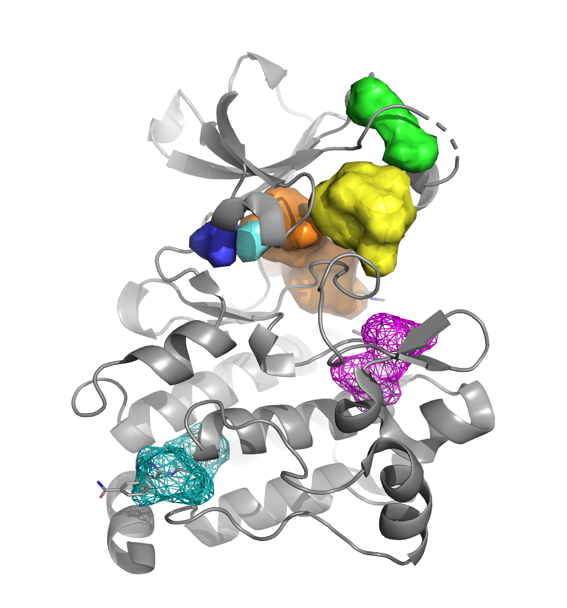

PyVOL: Protein Pocket Visualization, Segmentation, and Characterization
=======================================================================

 



Overview
========

PyVOL is a python library packaged into a [PyMOL](https://pymol.org/2/)
GUI for identifying protein binding pockets, partitioning them into
sub-pockets, and calculating their volumes. PyVOL can be run as a PyMOL
plugin through its GUI or the PyMOL prompt, as an imported python
library, or as a command-line program. Visualization of results is
exclusively supported through PyMOL though exported surfaces are
compatible with standard 3D geometry visualization programs. The project
is hosted on github by the Schlessinger Lab. Please access the
repository to view code or submit bugs. The package has been most
extensively tested with PyMOL 2.3+ running Python 3.7. Support for all
python versions 2.7+ is intended but not as thoroughly tested. Support
for PyMOL 1.7.4+ without the GUI is as yet incomplete. Unfortunately,
PyVOL can not currently run on MacOS Catalina due to its restrictions on
running 32-bit executables. The Mac-compatible MSMS executable is not
yet available in a 64-bit form.

Quick Installation into PyMOL 2.0+
==================================

PyVOL can be installed into any python environment, but installing
directly into PyMOL 2.0+ is easiest. Download the
basic GUI installer &lt;https://github.com/schlessingerlab/pyvol/blob/master/installers/pyvol-installer.zip&gt;
and then use the PyMOL plugin manager to install that file:
Plugins --&gt; Plugin Manager --&gt; Install New Plugin --&gt; Install from local file --&gt;
Choose file...

This installs the PyVOL GUI. Select
Plugins --&gt; PyVOL --&gt; Settings --&gt; Install PyVOL from PyPI to
fetch PyVOL and any missing dependencies. Once PyVOL has been installed,
the location of MSMS must be added to the path. In the MSMS Settings
panel, common locations for the executable can be searched. Once an
executable has been identified and is displayed, Change MSMS Path can be
clicked to make that executable visible to the back-end. The GUI should
then display that it can find MSMS. For academic users and non-academic
users with the Schrodinger incentive PyMOL distribution, installation is
now complete. For all others install:MSMS Installation.

Example Basic Run
=================

A simple calculation using the PyMOL prompt is to load a protein of
interest and then run the pocket command. This is an example for the
Sorafenib-bound structure of BRAF:

``` {.sourceCode .python}
fetch '1uwh'
pocket protein="1uwh and chain B"
```
